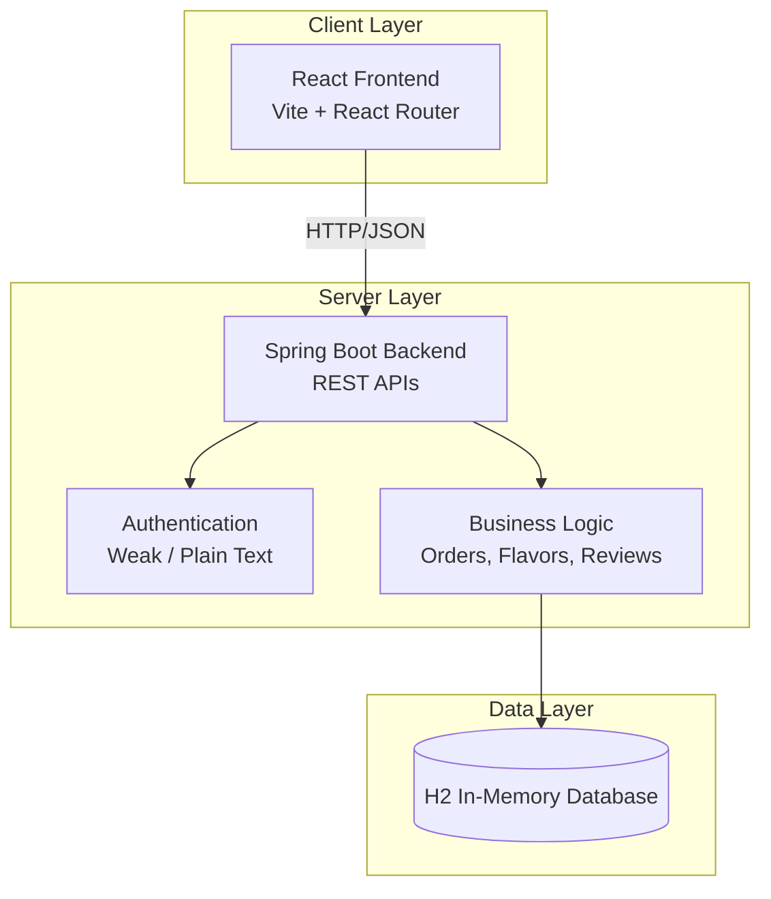

# Scoops of Brainfreeze – Architecture & Vulnerabilities

**Educational Project** – Deliberately Vulnerable Ice Cream Shop  
**Target Audience:** 3rd Year BE CSE Students  
**Purpose:** Teach OWASP Top 10:2025 through a fun, relatable application

---

## 1. High-Level Architecture



---

## 2. Currently Implemented Features

| Feature | Description | Vulnerability Demonstrated |
|---------|-------------|----------------------------|
| Home / Menu | List of ice cream flavors | - |
| User Login & Register | Create account / Login | A07 Authentication Failures, A04 Cryptographic Failures |
| Search Flavors | Search by name | A05 SQL Injection |
| Reviews | Leave and view reviews | A05 Stored XSS |
| View Orders by ID | Fetch any order | A01 Broken Access Control (IDOR) |
| Create Order | Place order with quantity | A06 Insecure Design (negative quantity) |
| Global Error Handling | Exception responses | A10 Mishandling of Exceptional Conditions |
| Security Configuration | CORS, CSRF, authorization | A02 Security Misconfiguration |

> **Note:** Admin Dashboard, File Upload (A08), and advanced logging (A09) are documented as teaching concepts but are **not yet implemented** in the current codebase.

---

## 3. OWASP Top 10:2025 Vulnerability Mapping

### A01:2025 – Broken Access Control ✅ Implemented

**Location:** `/api/orders/{id}`

**Vulnerable Behavior:**
- Any user can view or update any order by changing the ID
- No ownership check

**Possible Fixes:**
- Always verify the order belongs to the current user
- Use method-level security (`@PreAuthorize`)

---

### A02:2025 – Security Misconfiguration ✅ Implemented

**Location:** `SecurityConfig` + `application.properties`

**Vulnerable Behavior:**
- CSRF disabled
- CORS allows all origins
- All endpoints are `permitAll()`
- Verbose error messages and stack traces

---

### A04:2025 – Cryptographic Failures ✅ Implemented

**Location:** User password storage

**Vulnerable Behavior:**
- Passwords stored and compared in plain text

---

### A05:2025 – Injection ✅ Implemented

**SQL Injection** – `/api/flavors/search?q=`  
**Stored XSS** – Reviews (`dangerouslySetInnerHTML` on frontend)

---

### A06:2025 – Insecure Design ✅ Implemented

**Location:** Order creation

**Vulnerable Behavior:**
- Negative quantity is accepted and can produce negative totals

---

### A07:2025 – Authentication Failures ✅ Implemented

**Location:** `/api/auth/login`

**Vulnerable Behavior:**
- No rate limiting
- Plain text password comparison
- Predictable default accounts

---

### A10:2025 – Mishandling of Exceptional Conditions ✅ Implemented

**Location:** `GlobalExceptionHandler`

**Vulnerable Behavior:**
- Full exception details and stack traces returned to the client

---

### Not Yet Implemented (Teaching Concepts Only)

- **A03** Software Supply Chain Failures
- **A08** Software or Data Integrity Failures (File Upload)
- **A09** Security Logging and Alerting Failures

---

## 4. Installation & Running

### Prerequisites
- Java 17+
- Node.js 18+
- Maven

### Local Development

```bash
# Backend
cd backend
./mvnw spring-boot:run

# Frontend
cd frontend
npm install
npm run dev
```

- Backend: http://localhost:8080
- Frontend: http://localhost:3000

### Default Credentials

- Admin: `admin` / `softserve123`
- Student: `student` / `password`

---

## 5. How to Use in the Lecture

1. Show the normal user flow
2. Demonstrate one vulnerability at a time
3. Explain the root cause
4. Show the corresponding fix approach
5. Use quizzes between sections

---

## 6. Disclaimer

This application contains **intentional security vulnerabilities**.  
It must only be used in controlled educational environments.

Never expose it to the public internet without strong isolation.
