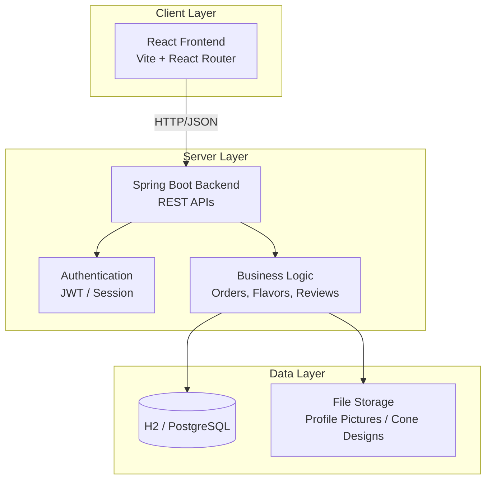
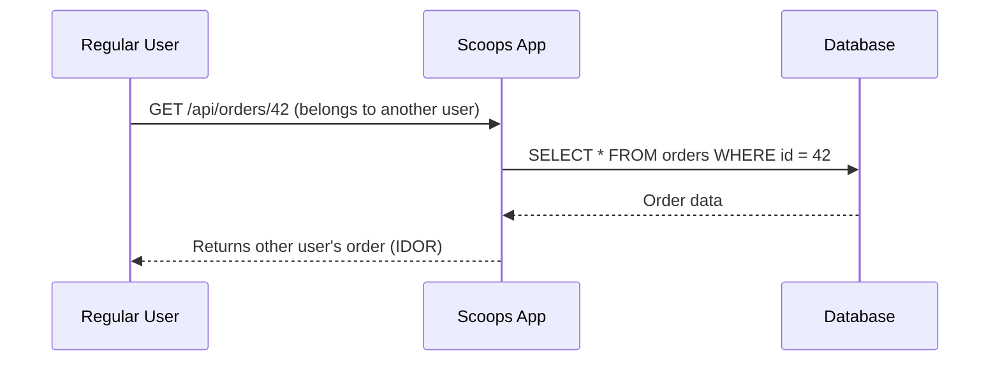
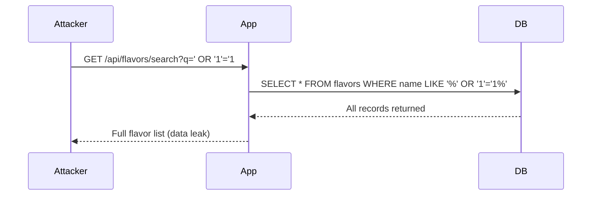

# Scoops of Brainfreeze – Architecture & Vulnerabilities

**Educational Project** – Deliberately Vulnerable Ice Cream Shop  
**Target Audience:** 3rd Year BE CSE Students  
**Purpose:** Teach OWASP Top 10:2025 through a fun, relatable application

---

## 1. High-Level Architecture



---

## 2. Application Features

| Feature | Description | Primary Vulnerability Opportunity |
|---------|-------------|-----------------------------------|
| Home / Menu | List of ice cream flavors | - |
| User Registration & Login | Create account / Login | A07 Authentication Failures |
| Place Order | Select flavor + quantity + notes | A05 Injection, A06 Insecure Design |
| My Orders | View own orders | A01 Broken Access Control (IDOR) |
| Reviews / Comments | Leave reviews on flavors | A05 Injection (Stored XSS / SQLi) |
| Search Flavors | Search by name | A05 Injection |
| Admin Dashboard | Manage orders, users, flavors | A01 Broken Access Control |
| Profile + Photo Upload | Update profile & upload image | A08 Software/Data Integrity |
| Contact / Feedback | Simple form | A10 Exception Handling |

---

## 3. OWASP Top 10:2025 Vulnerability Mapping

### A01:2025 – Broken Access Control

**Location:** Order details endpoint & Admin panel

**Vulnerable Behavior:**
- Any logged-in user can view/edit any order by changing the order ID in the URL (`/api/orders/123`)
- Regular users can access `/admin` endpoints



**Possible Fixes:**
- Always check that the order belongs to the current user
- Use `@PreAuthorize` or method-level security
- Implement proper ownership checks

---

### A02:2025 – Security Misconfiguration

**Location:** Application configuration & Error handling

**Vulnerable Behavior:**
- Default admin credentials: `admin` / `softserve123`
- Stack traces and detailed errors shown to users
- Unnecessary endpoints enabled
- CORS wide open

**Possible Fixes:**
- Change default credentials
- Disable detailed error pages in production
- Restrict CORS
- Disable unused actuators / endpoints

---

### A03:2025 – Software Supply Chain Failures

**Location:** Dependencies

**Vulnerable Behavior:**
- Intentionally outdated libraries with known CVEs
- No dependency scanning in CI

**Possible Fixes:**
- Keep dependencies updated
- Use tools like OWASP Dependency-Check / Snyk
- Pin versions and monitor advisories

---

### A04:2025 – Cryptographic Failures

**Location:** Password storage & Tokens

**Vulnerable Behavior:**
- Passwords stored using MD5 (or plain text in early versions)
- Weak JWT signing key
- Sensitive data in logs

**Possible Fixes:**
- Use BCrypt / Argon2
- Strong random keys for JWT
- Never log sensitive data

---

### A05:2025 – Injection

**Location:** Search, Reviews, Order notes

**Vulnerable Behavior:**
- SQL Injection in flavor search (`/api/flavors/search?q=`)
- Stored XSS in reviews



**Possible Fixes:**
- Use Prepared Statements / JPA properly
- Input validation + output encoding
- Content Security Policy (CSP)

---

### A06:2025 – Insecure Design

**Location:** Order quantity logic

**Vulnerable Behavior:**
- Negative quantity allowed → results in credit / free ice cream
- No business rule validation on price calculation

**Possible Fixes:**
- Server-side validation of business rules
- Never trust client-side calculations

---

### A07:2025 – Authentication Failures

**Location:** Login endpoint

**Vulnerable Behavior:**
- No rate limiting / account lockout
- Weak password policy
- Predictable session tokens in early versions

**Possible Fixes:**
- Implement rate limiting
- Strong password policy
- Secure session management

---

### A08:2025 – Software or Data Integrity Failures

**Location:** File upload (profile picture / custom cone design)

**Vulnerable Behavior:**
- Unrestricted file upload (any extension)
- No content-type validation
- Files stored in web-accessible directory

**Possible Fixes:**
- Whitelist allowed extensions
- Validate content type + magic bytes
- Store outside web root + serve via controlled endpoint

---

### A09:2025 – Security Logging and Alerting Failures

**Location:** Entire application

**Vulnerable Behavior:**
- No logging of failed logins, access control failures, or admin actions
- No alerting mechanism

**Possible Fixes:**
- Log authentication events, authorization failures, and sensitive actions
- Centralized logging + basic alerting

---

### A10:2025 – Mishandling of Exceptional Conditions

**Location:** Global exception handling

**Vulnerable Behavior:**
- Unhandled exceptions return full stack traces to the client
- Application continues in inconsistent state after errors

**Possible Fixes:**
- Global exception handler that returns generic messages
- Proper error recovery and logging

---

## 4. Installation & Running

### Prerequisites
- Java 17+
- Node.js 18+
- Maven
- Docker (optional but recommended)

### Local Development

```bash
# Backend
cd backend
./mvnw spring-boot:run

# Frontend
cd frontend
npm install
npm run dev
```

### Docker (Recommended for demos)

```bash
docker-compose up --build
```

---

## 5. How to Use in the Lecture

1. Show the normal user flow (ordering ice cream)
2. Demonstrate one vulnerability at a time
3. Explain the root cause using the Mermaid diagrams
4. Show the corresponding fix
5. Use live quizzes (Slidev) between sections

---

## 6. Disclaimer

This application contains **intentional security vulnerabilities**.  
It must only be used in controlled educational environments.

Never expose it to the public internet without strong isolation.
