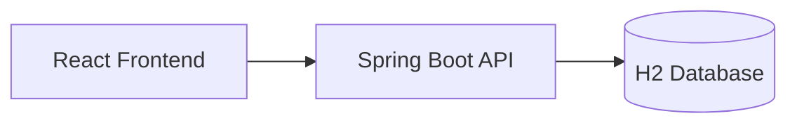

# 🍦 Scoops of Brainfreeze

### Teaching OWASP Top 10:2025 with Ice Cream

**Guest Lecture**  
Jansons Institute of Technology  
3rd Year BE CSE

---

# About Today

- Duration: ~60 minutes
- Style: Live demos + interactive quizzes
- Goal: Understand real vulnerabilities through a fun application

---

# Agenda

1. Why this application?
2. Quick architecture tour
3. Live attacks on Scoops of Brainfreeze
4. Interactive quizzes
5. How to fix the issues
6. Key takeaways + Q&A

---

# Why an Ice Cream Shop?

- Highly relatable
- Naturally funny
- Makes vulnerabilities memorable

> Students remember  
> “SQL Injection while searching for Chocolate Chip”  
> much better than abstract theory.

---

# The Application

**Scoops of Brainfreeze**

- Frontend: React
- Backend: Spring Boot
- Intentionally vulnerable by design

Repo: https://github.com/rajahpixelphone/scoops-of-brainfreeze

---

# Architecture



Simple. Clear. Perfect for demos.

---

# Live Demo Time 🔥

We will now attack our own ice cream shop.

Open: http://localhost:3000

---

# Demo 1 – SQL Injection

**Page:** Search Flavors

**Try this payload:**

```
' OR '1'='1
```

What happens?

---

# Why did that work?

Vulnerable native query:

```sql
SELECT * FROM flavors WHERE name LIKE %:keyword%
```

No proper parameterization in the vulnerable version.

---

# Demo 2 – Stored XSS

**Page:** Reviews

**Try this comment:**

```html
<script>alert('XSS from Ice Cream')</script>
```

Refresh the page → the script runs.

---

# Why is this dangerous?

- Stored in the database
- Rendered without sanitization
- Affects every user who views the reviews

---

# Demo 3 – IDOR (Broken Access Control)

**Page:** Orders

- Create an order (or use existing ID)
- Change the order ID in the request
- You can view **any** customer’s order

No ownership check.

---

# Demo 4 – Weak Authentication

**Page:** Login

Default credentials:

- `admin` / `softserve123`
- `student` / `password`

Problems:
- Plain text passwords
- No rate limiting
- Predictable accounts

---

# Quick Quiz Time 🎯

<!-- slidev-addon-slide-quiz will be used here -->

**Question:** What does IDOR stand for?

A) Insecure Direct Object Reference  
B) Internal Data Object Routing  
C) Identity Domain Ownership Rule

---

# Another Quiz

**Which vulnerability allows an attacker to run JavaScript in another user’s browser?**

A) SQL Injection  
B) Stored XSS  
C) IDOR  
D) CSRF

---

# How Do We Fix These?

### SQL Injection
- Always use parameterized queries / prepared statements
- Prefer JPA method names or Criteria API

### Stored XSS
- Encode output
- Use a proper sanitizer
- Content Security Policy (CSP)

### IDOR
- Always verify ownership
- Never trust user-supplied IDs alone

### Authentication
- Hash passwords (BCrypt / Argon2)
- Add rate limiting
- Use proper session / JWT handling

---

# Key Takeaways

1. Security is not optional
2. Never trust user input
3. Simple mistakes create serious vulnerabilities
4. Understanding attacks helps you write better code

---

# Resources

- OWASP Top 10: https://owasp.org/Top10/
- Project Repo: https://github.com/rajahpixelphone/scoops-of-brainfreeze
- Documentation inside the repo (`docs/`)

---

# Thank You!

**Questions?**

Feel free to explore the application and try breaking it further.

---

# Bonus Challenge

Can you find more vulnerabilities in Scoops of Brainfreeze?

(There are still a few more waiting...)
