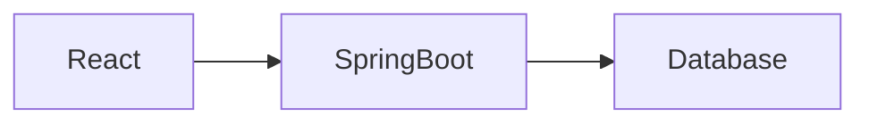

# Scoops of Brainfreeze

### Teaching OWASP Top 10:2025 with Ice Cream

A deliberately vulnerable application for 3rd Year BE CSE students

---

# Agenda

1. Why this application?
2. Quick tour of Scoops of Brainfreeze
3. OWASP Top 10:2025 – Live Demos
4. Interactive Quizzes
5. How to fix the issues
6. Q&A

---

# Why Ice Cream?

- Relatable
- Funny
- Memorable
- Students remember "SQL Injection while searching for Chocolate Chip" much better than abstract examples

---

# Architecture Overview

- Frontend: React
- Backend: Spring Boot
- Intentionally vulnerable by design

---

# Live Demo Time

We will now attack our own ice cream shop.

---

# Quiz 1 – Warm up

<!-- Add slidev-addon-slide-quiz here later -->

**What does IDOR stand for?**

---

# A01 – Broken Access Control

- View any customer’s order by changing the ID
- Access admin features as a normal user

---

# A05 – Injection

- SQL Injection in the flavor search
- Stored XSS in reviews

---

# More vulnerabilities coming...

(A02, A04, A06, A07, A08, A09, A10)

---

# How to Fix

We will look at practical fixes for each issue after the demos.

---

# Thank You

**Questions?**

Repo: https://github.com/rajahpixelphone/scoops-of-brainfreeze
